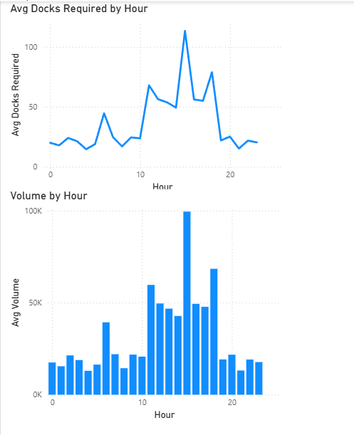

# Inbound Logistics Capacity Analysis

## Objective

The goal of this project is to analyze inbound vehicle arrival patterns and evaluate dock capacity requirements across different hours of the day. The analysis focuses on identifying peak load windows, understanding volume distribution, and highlighting capacity gaps in inbound operations.

---

## Tools Used

* Excel (data preparation)
* MySQL (data querying and aggregation)
* Power BI (data visualization and dashboarding)

---

## Dataset

The dataset represents 14 days of inbound vehicle arrivals with the following fields:

* Date
* Vehicle_Number
* Previous_Node
* Origin_Type (Milkrun / Longhaul)
* Vehicle_Size
* Arrival_Time
* Volume
* Dock_Capacity
* Required_Docks
* Hour

---

## Approach

### 1. Data Preparation

* Cleaned and structured raw data in Excel
* Standardized column names and formats
* Derived hourly data for analysis

---

### 2. SQL Analysis

* Calculated hourly dock demand
* Aggregated volume by hour
* Identified peak load hours
* Compared required vs available dock capacity

---

### 3. Dashboard Development

A Power BI dashboard was built to visualize:

* Dock Demand (Average per Day by Hour)
* Inbound Volume (Average per Day by Hour)

---

## Key Insights

* Inbound volume is highly concentrated between **14:00–16:00**, creating a sharp spike in dock demand.

* Peak dock requirement exceeds available capacity (7 docks) by a significant margin, indicating a clear operational bottleneck.

* Volume and dock demand trends are closely aligned, confirming that arrival timing directly drives capacity stress.

* Early morning and late evening hours show relatively low load, suggesting opportunities for load balancing and better scheduling.

---

## Dashboard Preview

---

## Conclusion

The analysis highlights a strong mismatch between inbound arrival patterns and dock capacity. Peak-hour congestion can lead to delays and inefficiencies, while off-peak hours remain underutilized. Data-driven insights like these can support better capacity planning and operational decision-making.

---

## Files in Repository

* `Dataset/Inbound_Arrival.csv` → Raw dataset
* `sql/Inbound_view.sql` → SQL queries
* `dashboard/inbound_view_dashboard.png` → Dashboard preview
* `README.md` → Project documentation
## Business Impact

- Peak hour demand exceeds dock capacity by 10–15x, indicating severe operational bottlenecks  
- Current static dock allocation is inefficient for variable hourly demand  
- Significant idle capacity exists during off-peak hours, leading to resource underutilization  
- Suggests need for dynamic dock allocation and staggered scheduling strategy

## Recommendations

- Introduce staggered arrival scheduling for vehicles  
- Increase temporary dock capacity during peak hours  
- Shift part of inbound load to off-peak windows  
- Improve forecasting for proactive workforce planning  

---

## Future Scope

* Introduce forecasting based on historical patterns
* Model backlog and rollover capacity
* Optimize dock allocation and scheduling strategies
